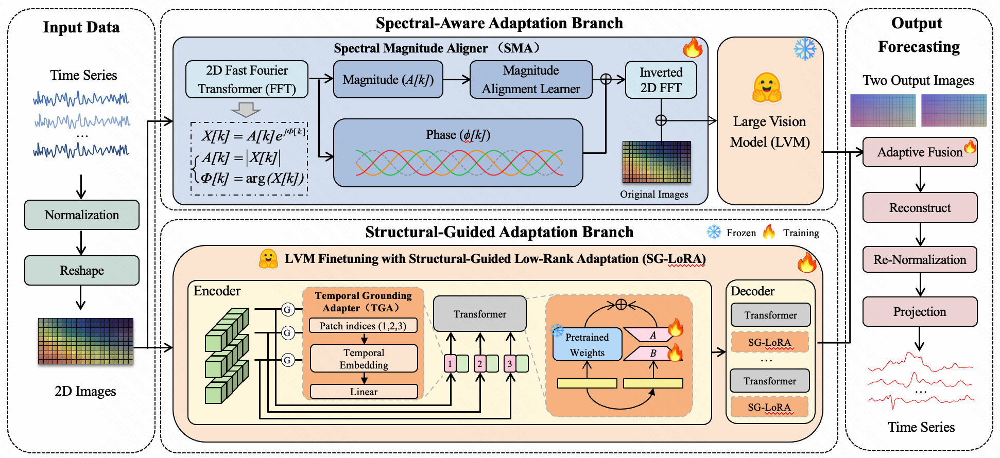

# SSDA: Spectral and Structural Dual Adaptation for Time Series Forecasting

## Overview

SSDA is a vision-based time series forecasting framework that adapts Large Vision Models (LVMs) through **dual adaptation mechanisms**. Unlike prior work that directly applies pre-trained vision models to rendered time series, SSDA explicitly identifies and bridges two fundamental modality gaps:

* **Spectral Gap**: Mismatch in frequency-domain statistics between time series images and natural images
* **Structural Gap**: Distortion of temporal relationships caused by 1D-to-2D reshaping

To address these issues, SSDA introduces a **dual-branch architecture**:

* A **Spectral Branch** that aligns frequency statistics at the data level
* A **Structural Branch** that restores temporal structure at the model level

The two branches are adaptively fused to produce the final prediction.

---

## Motivation

Recent work shows that rendering time series as images allows LVMs (e.g., MAE) to achieve strong forecasting performance. However, this paradigm relies on a strong assumption:

> Rendered time series images are sufficiently similar to natural images.

SSDA revisits this assumption and shows:

* Time series images exhibit **different power spectrum distributions** (lower α)
* 2D reshaping introduces:

  * **Spurious spatial adjacency**
  * **Broken temporal continuity**

These issues fundamentally limit the transferability of pre-trained vision models.

---

## Architecture

*Figure 2: Overall architecture of SSDA.*

---

## Installation

'''bash
git clone https://anonymous.4open.science/r/SSDA-8C5B
cd SSDA

pip install -r requirements.txt
'''

---

## Quick Start

### Training

'''bash
python -u run.py \
   --task_name long_term_forecast \
   --is_training 1 \
   --root_path /remote-home/data/ETT/ \
   --data_path ETTh1.csv \
   --model_id ETTh1_1440_96 \
   --model SSDA \
   --data ETTh1 \
   --features M \
   --seq_len 1440 \
   --label_len 48 \
   --pred_len 96 \
   --e_layers 2 \
   --d_layers 1 \
   --factor 1 \
   --enc_in 7 \
   --dec_in 7 \
   --c_out 7 \
   --learning_rate 0.000002 \
   --des 'Exp' \
   --n_heads 2 \
   --itr 1 \
   --periodicity 24 \
   --percent 100
'''

---

## Model Parameters

| Parameter           | Description               | Default |
| ------------------- | ------------------------- | ------- |
| seq_len             | Input sequence length     | 1440    |
| label_len           | Start token length        | 48      |
| pred_len            | Prediction length         | 96      |
| d_model             | Hidden dimension          | 512     |
| n_heads             | Attention heads           | 8       |
| e_layers            | Encoder layers            | 2       |
| periodicity         | Image reshape periodicity | 24      |
| r                   | LoRA rank                 | 4       |
| lora_alpha          | LoRA scaling              | 16      |
| residual_weight (λ) | Spectral residual weight  | 0.05    |

---

## Datasets

SSDA supports the following datasets:

* ETT (ETTh1, ETTh2, ETTm1, ETTm2)
* Weather
* Electricity
* Traffic

---

## Results

SSDA achieves:

* **State-of-the-art performance** across 7 benchmarks
* **48 first-place results** in full-shot experiments
* **~7.8% MSE reduction** over strongest baselines

---
